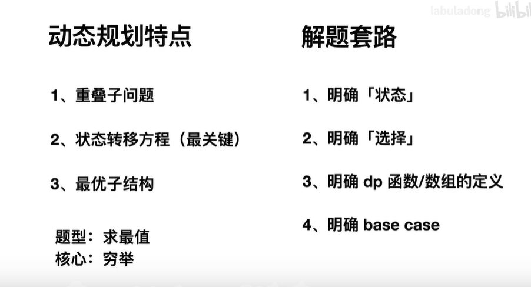
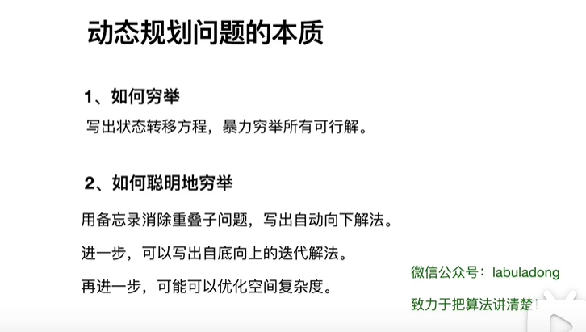

# 动态规划

## 动态规划特点与解题套路

首先，**动态规划问题的一般形式就是求最值**。动态规划其实是运筹学的一种最优化方法，只不过在计算机问题上应用比较多，比如说让你求**最长**递增子序列呀，**最小**编辑距离呀等等。

既然是要求最值，核心问题是什么呢？求解动态规划的核心问题是穷举。因为要求最值，肯定要把所有可行的答案穷举出来，然后在其中找最值呗。

首先，动态规划的穷举有点特别，因为这类问题**存在「重叠子问题**，如果暴力穷举的话效率会极其低下，所以需要「备忘录」或者「DP table」来优化穷举过程，避免不必要的计算。

而且，动态规划问题一定会**具备「最优子结构**，才能通过子问题的最值得到原问题的最值。

另外，虽然动态规划的核心思想就是穷举求最值，但是问题可以千变万化，穷举所有可行解其实并不是一件容易的事，只有列出**正确的「状态转移方程**，才能正确地穷举。

## 明确 base case -> 明确「状态」-> 明确「选择」 -> 定义 dp 数组/函数的含义。

按上面的套路走，最后的结果就可以套这个框架：

    # 初始化 base case
    dp[0][0][...] = base
    # 进行状态转移
    for 状态1 in 状态1的所有取值：
        for 状态2 in 状态2的所有取值：
            for ...
                dp[状态1][状态2][...] = 求最值(选择1，选择2...)

## LeetCode-322. 零钱兑换

给定不同面额的硬币 coins 和一个总金额 amount。编写一个函数来计算可以凑成总金额所需的最少的硬币个数。如果没有任何一种硬币组合能组成总金额，返回 -1。

你可以认为每种硬币的数量是无限的。

示例 1：

    输入：coins = [1, 2, 5], amount = 11
    输出：3 
    解释：11 = 5 + 5 + 1

示例 2：

    输入：coins = [2], amount = 3
    输出：-1

示例 3：

    输入：coins = [1], amount = 0
    输出：0

示例 4：

    输入：coins = [1], amount = 1
    输出：1

示例 5：

    输入：coins = [1], amount = 2
    输出：2

Linked：https://leetcode-cn.com/problems/coin-change

代码实现:
    
    class Solution:
    def coinChange(self, coins: List[int], amount: int) -> int:
        """状态: dp[i], 钱数为i需要最少的币数
           转移方程: dp[i] = min(dp[i], 1+dp[i - coin]), 即当前钱所需的面值钱数=1+凑够(1 - coin)所需的钱数"""
        dp = [amount + 1] * (amount + 1)  # 最小面值为1, 最大次数不会超过amount 
        # base case 
        dp[0] = 0  # 面值为0, 不需要凑钱
        # 外层 for 循环在遍历所有状态的所有取值
        for i in range(len(dp)):
            # 内层 for 循环在求所有选择的最小值
            for coin in coins:
                # 子问题无解，跳过
                if (i - coin < 0):
                    # 面值大于钱的总数, 舍弃此面值
                    continue 
                # 状态转移方程
                dp[i] = min(dp[i], 1+dp[i - coin])  # 当前钱所需的面值钱数=1+凑够(1 - coin)所需的钱数
        
        if dp[amount] == (amount + 1):
            return -1 
        
        return dp[amount] 
    
    # 方法二 --- 自顶而下的方法
    def coinChange(coins: List[int], amount: int):
        # 备忘录
        memo = dict()
        def dp(n):
            # 查备忘录，避免重复计算
            if n in memo: return memo[n]
            # base case
            if n == 0: return 0
            if n < 0: return -1
            res = float('INF')
            for coin in coins:
                subproblem = dp(n - coin)
                if subproblem == -1: continue
                res = min(res, 1 + subproblem)
    
            # 记入备忘录
            memo[n] = res if res != float('INF') else -1
            return memo[n]
    
        return dp(amount)

## 动态规划的本质

**解决两个字符串的动态规划问题，一般都是用两个指针 i,j 分别指向两个字符串的最后，然后一步步往前走，缩小问题的规模。**

## LeetCode-72. 编辑距离

Linked:https://leetcode-cn.com/problems/edit-distance/

代码实现:

    class Solution:
    def minDistance(self, word1: str, word2: str) -> int:
        """状态f[i][j], word1前i个字符与word2前j个字符的编辑距离"""
        m, n = len(word1), len(word2)
        # base case 
        dp = [[0]*(n+1) for _ in range(m+1)]
        for i in range(1, m+1):
            dp[i][0] = i 
        for j in range(1, n+1):
            dp[0][j] = j 

        # 自底而上求解
        for i in range(1, m+1):
            for j in range(1, n+1):
                # 两种情况的状态转移方程
                if word1[i-1] == word2[j-1]:
                    # 当前字符不需要操作, 编辑次数等于上一次结果
                    dp[i][j] = dp[i-1][j-1]
                else:
                    # 次数操作次数，等于上一次+1
                    # 理解哪个指针需要移动
                    dp[i][j] = min(
                        dp[i - 1][j] + 1,  # word1删除
                        dp[i][j - 1] + 1,  # word1插入
                        dp[i - 1][j - 1] + 1,  # word1替换
                    )

        # 储存着整个 s1 和 s2 的最小编辑距离
        return dp[m][n]
        
## 1143. 最长公共子序列

Linked：https://leetcode-cn.com/problems/longest-common-subsequence/
        
代码实现：

    class Solution:
        def longestCommonSubsequence(self, text1: str, text2: str) -> int:
            """动态规划, LCS---最长公共子序列
            状态: f[i][j]代表, text1前i个字符与text2前j个字符的最大公共子序列
            状态转移方程：
            1. text1[i]==text2[j], 第i个字符与第j个字符相同，dp[i][j] = dp[i-1][j-1] + 1, 
            2. text1[i]==text2[j], 第i个字符与第j个字符不相同, dp[i][j] = max(dp[i][j-1], dp[i-1][j]),
            即text1前i个字符与text2前j-1一个字符的最大公共子序列，
            或者text1前i-1个字符与text2前j一个字符的最大公共子序列，取两者的最大值"""
            n, m = len(text1), len(text2)
            dp = [[0]*(m+1) for _ in range(n+1)]
    
            for i in range(1, n+1):
                for j in range(1, m+1):
                    if text1[i-1] == text2[j-1]:
                        # text1第i个字符与text2第j个字符相等
                        dp[i][j] = dp[i-1][j-1] + 1 
                    else:
                        # s1[i] 和 s2[j] 中至少有一个字符不在 lcs 中
                        dp[i][j] = max(dp[i][j-1], dp[i-1][j])
    
            return dp[n][m]

## LeetCode-516. 最长回文子序列

Linked: https://leetcode-cn.com/problems/longest-palindromic-subsequence/

代码实现:

    class Solution:
        def longestPalindromeSubseq(self, s: str) -> int:
            """动态规划
            状态: f[i][j], 代表s 的第 i 个字符到第 j 个字符组成的子串中，最长的回文序列长度是多少
            转移方程：i从字符后向前移动，j从前向后移动, 从i节点向两边移动
            1. s[i] == s[j], f[i][j] = f[i+1][j-1] + 2
            2. s[i] != s[j], f[i][j] = max(f[i+1][j], f[i][j-1]), 
            即退回到上一步，等于j到i+1子串与j-1到i的最大值"""
            n = len(s)
            dp = [[0]*(n+1) for _ in range(n+1)]  # dp[n][0] base case 
            for i in range(n-1, -1, -1):
                dp[i][i] = 1  # 中间位置字符就是一个回文字符
                for j in range(i+1, n):
                    # 状态转移方程
                    if s[i] == s[j]:
                        dp[i][j] = dp[i+1][j-1] + 2  # 等于前一次最大回文子序列
                    else:
                        dp[i][j] = max(dp[i+1][j], dp[i][j-1])  
            
            return dp[0][n-1]

        def longestPalindromeSubseq(self, s: str) -> int:
            """动态规划
            将字符串s反转，转化为求解两字字符串的最长公共子序列"""
            s_r = s[::-1]
            n, m = len(s), len(s_r)
    
            dp = [[0]*(m+1) for _ in range(n+1)]
            for i in range(1, n+1):
                for j in range(1, m+1):
                    if s[i-1] == s_r[j-1]:
                        dp[i][j] = dp[i-1][j-1] + 1
                    else:
                        dp[i][j] = max(dp[i][j-1], dp[i-1][j])
            
            return dp[n][m]

## LeetCode-583. 两个字符串的删除操作

Linked: https://leetcode-cn.com/problems/delete-operation-for-two-strings/

代码实现: 

    class Solution:
        def minDistance(self, word1: str, word2: str) -> int:
            """动态规划"""
            def longestCommonSubsequence(word1: str, word2: str) -> int:
                """求解两个字符串的最大公共子序列
                状态: dp[i][j], 代表word1前i个字符与word2前j字符的最大公共子序列
                转移方程: dp[i][j] = | 1 + dp[i-1][j-1], word1[i] = word2[j]
                                    |max(d[i][j-1], d[i-1][j]), word1[i] != word2[j]"""
                n, m = len(word1), len(word2)
                dp = [[0]*(m+1) for _ in range(n+1)]
                for i in range(1, n+1):
                    for j in range(1, m+1):
                        if word1[i-1] == word2[j-1]:
                            dp[i][j] = dp[i-1][j-1] + 1 
                        else:
                            dp[i][j] = max(dp[i][j-1], dp[i-1][j])
    
                return dp[n][m]
    
            common_length = longestCommonSubsequence(word1, word2)
            
            # 减去公共部分不需要删除的，其他的就是需要删除的
            return len(word1) - common_length + len(word2) - common_length

## LeetCode-712. 两个字符串的最小ASCII删除和
        
Linked: https://leetcode-cn.com/problems/minimum-ascii-delete-sum-for-two-strings/

代码实现:

    class Solution:
        def minimumDeleteSum(self, s1: str, s2: str) -> int:
            """转换为求解最大公共子序列的最大ascall值和, min_delete = sum_value - max_common_sub_value
            状态: d[i][j], 代表s1前i个字符与s2前j个字符的最大公共子序列最大ascall值之和
            转移方程:d[i][j] = | d[i-1]d[j-1] + ord(c),  s[i] = s[j]
                              | max(d[i][j-1], d[i-1]d[j]), s[i] != s[j]"""
            sum_value = 0
            for c in s1:
                sum_value += ord(c)
            for c in s2:
                sum_value += ord(c)
    
            n, m = len(s1), len(s2)
            dp = [[0]*(m+1) for _ in range(n+1)]  # base case dp[0][0] = 0 
            for i in range(1, n+1):
                for j in range(1, m+1):
                    if s1[i-1] == s2[j-1]:
                        dp[i][j] = dp[i-1][j-1] + ord(s1[i-1])
                    else:
                        dp[i][j] = max(dp[i][j-1], dp[i-1][j])
            
            return sum_value - 2*dp[n][m]  # dp[n][m] --- 主要取决于base case的位置

## LeetCode-718. 最长重复子数组

Linked: https://leetcode-cn.com/problems/maximum-length-of-repeated-subarray/

代码实现: 
    
    class Solution:
        def findLength(self, nums1: List[int], nums2: List[int]) -> int:
            """动态规划
            状态: dp[i][j], 代表以nums1[i]结尾的最长重复子数组
            转移方程: dp[i][j] = dp[i-1][j-1] + 1, nums1[i] == nums2[j]"""
            n, m = len(nums1), len(nums2)
    
            dp = [[0]*(m+1) for _ in range(n+1)]
            max_value = -1 
            for i in range(1, n+1):
                for j in range(1, m+1):
                    if nums1[i-1] == nums2[j-1]:
                        dp[i][j] = dp[i-1][j-1] + 1 
                    max_value = max(max_value, dp[i][j])
            
            return max_value

## LeetCode-5. 最长回文子串 

Linked: https://leetcode-cn.com/problems/longest-palindromic-substring/

代码实现: 

    class Solution:
        """测试用例："aacabdkacaa" 无法过"""
        def longestPalindrome(self, s: str) -> str:
            """动态规划, 将S字符串反转, 转化为求解最长子串
            状态: dp[i][j], 代表以s[i]字符结尾的最长子串
            转移方程: dp[i][j] = dp[i-1][j-1] + 1"""
            sr = s[::-1]
            n, m = len(s), len(sr)
            dp = [[0]*(m+1) for _ in range(n+1)]
    
            max_value = 0  # 最大公共子串长度
            end_index = 0
            for i in range(1, n+1):
                for j in range(1, m+1):
                    if s[i-1] == sr[j-1]:
                        dp[i][j] = dp[i-1][j-1] + 1 
                    if dp[i][j] > max_value:
                        max_value = dp[i][j]
                        end_index = i  # 以 i 位置结尾的字符
    
            sub_str = s[end_index-max_value:end_index]    
    
            return sub_str

## LeetCode-300. 最长递增子序列

Linked: https://leetcode-cn.com/problems/longest-increasing-subsequence/

代码实现: 

    class Solution:
        def lengthOfLIS(self, nums: List[int]) -> int:
            """动态规划
            状态: dp[i], 代表考虑前 i 个元素，以第 i 个数字结尾的最长上升子序列的长度
            转移方程: dp[i] = max(dp[i], dp[0...i-1]+1), nums[i] > nums[0...i-1], 
            即dp[i]依次与0..i-1 dp + 1比较取最大值, 即以num[0...i-1]结尾最大上升子序列长度+1"""
            n = len(nums)
            dp = [1]*(n)
            max_length = dp[0]
            for i in range(1, n):
                for j in range(i):
                    if nums[i] > nums[j]:
                        dp[i] = max(dp[i], dp[j] + 1)
                
                max_length = max(max_length, dp[i])  # 对比每个位置最大值
            
            return max_length

## LeetCode-64. 最小路径和

Linked: https://leetcode-cn.com/problems/minimum-path-sum/

代码实现:

    class Solution:
        def minPathSum(self, grid: List[List[int]]) -> int:
            """动态规划
            状态: dp[i][j], 代表从(0, 0)位置到(i, j)位置的最小路径和
            转移方程：dp[i][j] = | grid[i][j], i==0 and j == 0 
                                | min(dp[i-1][j], dp[i][j-1]) + grid[i][j], 
                                即左边和上边的最小路径和+当前坐标值"""
            n, m = len(grid), len(grid[0])
            dp = [[float("inf")]*(m+1) for _ in range(n+1)]
    
            for i in range(1, n+1):
                for j in range(1, m+1):
                    if i == 1 and j == 1:
                        dp[i][j] = grid[i-1][j-1]  # base case 
                    else:
                        # 状态转移方程, 当前坐标的最小值 = 正上与左边的最小值 + 当前坐标值
                        dp[i][j] = min(dp[i-1][j], dp[i][j-1]) + grid[i-1][j-1]
            
            return dp[n][m]
